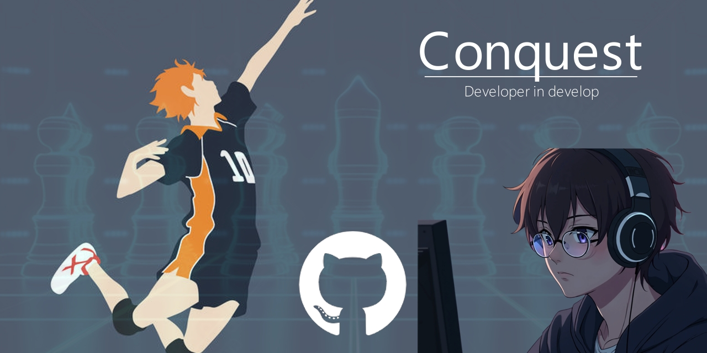

<h1 align="center">Hi , I'm Juan Diego Huaman Monzon </h1>

  

  

 
	 
	<!---
		
	-->

## <picture></picture> About me
- 🎓 I’m currently studying at the **Universidad Peruana de Ciencias Aplicadas (UPC)**
- 🌱 I’m currently learning **Full-Stack Development**
- 💬 Ask me about **Web Development, JavaScript, and Python**
- 📫 How to reach me: **diego0204.hm2@gmail.com**
- 🏐 I love playing **volleyball** during my free time

---

### 🛠 &nbsp;Tech Stack

&nbsp;
&nbsp;
&nbsp;
&nbsp;
&nbsp;\
&nbsp;
&nbsp;
&nbsp;
&nbsp;
&nbsp;
&nbsp;\
&nbsp;

&nbsp;

### ⚙️ &nbsp;GitHub Analytics

## 📞 Contact with Me

  
  
  

